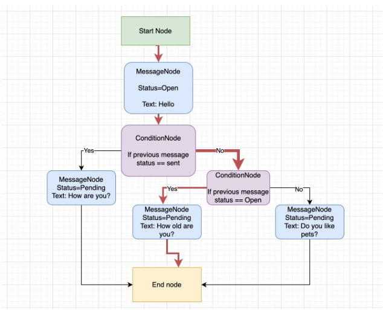

# API для управління workflow

Необхідно розробити API для управління workflow, використовуючи концепцію графів. Система повинна дозволяти створювати 4 типи вузлів (nodes). Та має включати розробку API з використанням FastAPI та Pydantic для обробки веб-запитів, інтеграцію з бібліотекою networkX для управління графами, реалізацію алгоритму для визначення шляху від початкового до кінцевого вузла.

# Опис типів вузлів:
1) Start Node:
    - Може мати лише одне вихідне ребро (edge).
    - Не може мати вхідних ребер.
2) Message Node:
    - Може мати статуси: pending, sent, opened.
    - Має мати текст повідомлення.
    - Може мати тільки одне вихідне ребро.
    - Може мати декілька вхідних ребер.
3) Condition Node:
    - Може мати два вихідних ребра: Yes та No. Якщо умова (condition) є істинною (True), вибирається шлях через Yes ребро, якщо хибною (False) – через No ребро.
    - Може мати декілька вхідних ребер. Може бути з'єднана з Message Node або іншою Condition Node, але умова повинна обраховуватися лише на основі статусу останньої виконаної Message Node. 
4) End Node:
    - Це кінцевий вузол для workflow.
    - Може мати декілька вхідних ребер.
    - Не може мати вихідних ребер.

# Вимоги до API:
- Створення,Оновлення,Видалення Workflow.
- Створення Nodes: Endpoint для додавання нових вузлів (Start, Message, Condition, End) до workflow.
- Конфігурація вузлів: Можливість змінювати параметри для вузлів або видаляти вузли. 
- Запуск Workflow: Endpoint для ініціалізації та запуску обраного Workflow, з поверненням детального шляху від Start до End Node. Або помилкою що не можна дійти від start до end вузла з описом причини.

# Технології:
- networkX: для побудови графів.
- pytest: для написання тестових прикладів і тестування алгоритму та API.
- FastAPI: для побудови API.
- Pydentic: Для валідації даних.
- sqlalchemy або tortoiseorm для роботи з базою даних.
- Nice to use https://zerosteiner.github.io/rule-engine/ для обчислення conditions в Condition Nodes але не обов'язково.

# Візуальний приклад workflow для кращого сприйняття.
